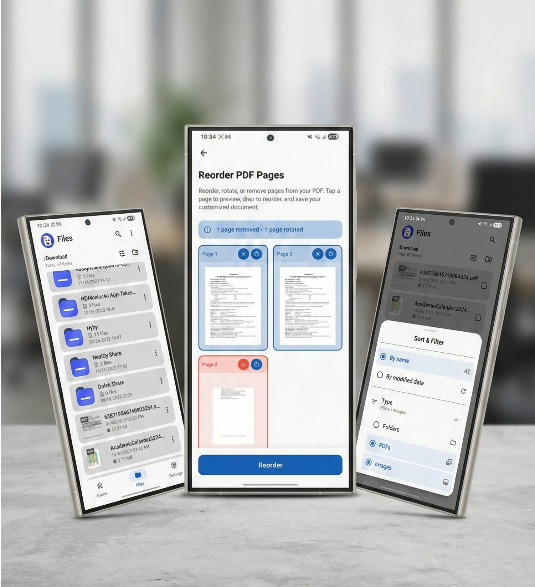

# PDF Kit &nbsp; [](https://github.com/self-Puneet/PDF-Kit/releases/download/AppBuild/app-release.apk)

<center>
</center>
PDF Kit is a concise, modular Flutter project focused on file and PDF-related functionality. It provides a robust suite of tools for viewing, combining, and managing PDF files and images.

## 🚀 Features

  * **File Management:** In-app file and folder explorer.
  * **PDF Operations:**
      * Merge multiple PDFs into one.
      * Convert Images to PDF & Merge Images.
      * Compress, split, and reorder pages.
      * **Security:** Add and remove password protection.
  * **Viewing:** Native viewing for PDFs and images (supports GIF previews).
  * **Customization:** Live Theme & Language switcher.
  * **Settings:** Comprehensive control over permissions, destination folders, and naming conventions.

## 🛠 Tech Stack

  * **Language:** Dart (SDK constraint: `^3.9.2`)
  * **Framework:** Flutter
  * **State Management:** `provider`
  * **Routing:** `go_router`

### Key Libraries

| Category | Packages |
| :--- | :--- |
| **PDF Core** | `pdfx`, `pdf`, `pdf_combiner` |
| **File/IO** | `path_provider`, `external_path`, `open_filex` |
| **Media** | `image_picker`, `flutter_image_compress`, `signature` |
| **Utils** | `permission_handler`, `share_plus` |

## 📂 Project Structure

```text
lib/
├── core/
│   ├── enums/
│   ├── exception/
│   ├── localization/
│   ├── routing/
│   ├── theme/
│   └── utility/
├── models/
├── presentation/
│   ├── component/
│   ├── layouts/       # Widget layouts / screens
│   ├── models/
│   ├── pages/
│   ├── provider/
│   └── sheets/
├── providers/
└── service/
assets/
android/
```

## 🤖 Android Configuration

### SDK Versions

This project delegates numeric SDK values to the Flutter toolchain via `android/app/build.gradle.kts`.

  * **minSdk:** 21 (Default Flutter support)
  * **targetSdk / compileSdk:** 34 (Recommended)

To verify the exact SDK values currently being used by your build, run:

```powershell
cd android
./gradlew :app:properties
```

### Permissions

The app requires the following permissions in `AndroidManifest.xml`:

  * **Network:**
      * `android.permission.INTERNET`
      * `android.permission.ACCESS_NETWORK_STATE`
  * **Storage / Files:**
      * `android.permission.READ_EXTERNAL_STORAGE`
      * `android.permission.WRITE_EXTERNAL_STORAGE` (Legacy)
      * `android.permission.MANAGE_EXTERNAL_STORAGE` (Android 11+ for broad access)
  * **Media:**
      * `android.permission.CAMERA` (For image capture features)

> **Note:** Runtime permissions are handled gracefully using `permission_handler`.

## ⚡️ Quick Start

1.  **Install Dependencies:**

    ```bash
    flutter pub get
    ```

2.  **Run the App:**

    ```bash
    flutter run
    ```

3.  **Clean Build (if modifying Gradle files):**

    ```bash
    flutter clean
    flutter pub get
    ```

## 📄 License

See the `LICENSE` file in the project root for details.

-----

### 📝 Improvements Made

  * **Consolidation:** Merged the "Quick summary" and "Quick facts" sections to avoid repetition.
  * **Formatting:** Fixed the broken PowerShell code block that interrupted the text in your original draft.
  * **Organization:** Grouped all Android-specific information (SDKs and Permissions) into one clear section.
  * **Visuals:** Added a table for the libraries to make the tech stack easier to scan.
  * **Cleanup:** Removed internal notes (like "Why this README") to make it suitable for public viewing/GitHub.
